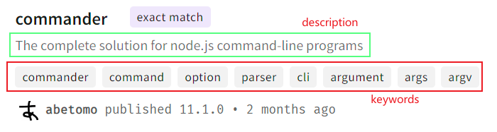

[package.json | npm Docs (npmjs.com)](https://docs.npmjs.com/cli/v10/configuring-npm/package-json#name)
### - name 模块名称
该字段是一个字符串，表示模块名称属性。
```json
"name": "your-pkg-name"
```
如果你计划发布你的模块包，那么在你的package.json中最重要的是name和version字段，因为它们是必需的。name和version一起形成一个完全唯一的标识符，对软件包的更改应该伴随着对版本的更改。

如果你不计划发布你的软件包，name和version字段是可选的。

name命名规范：
	- 长度必须小于214字符
	- 公开源的包不能以"."和"\_"开头
	- 不能包含大写字母
	- 不能和其他模块名称相同（可以使用`npm view`命令查询模块名称是否重复）
	- name最终成为URL的一部分，在命令行上是一个参数，也是一个文件夹的名称。因此，名称不能包含任何`非URL安全`的字符。
不安全url字符：
	- 空格`" "`
	- 大于小于号`<>`
	- 方括号`[]`
	- 花括号`{}`
	- 竖线`|`
	- 反斜杠`\`
	- 插入号`^`
	- 百分比`%`
>私有源npm包默认不会发布，包名以`@`开头，例如`@element-plus/components`不会发布。
 若为`pnpm构建的monorepo`风格的项目，根目录的name可为空，private字段设置为true。
### - version 版本
该字段是一个字符串，表示模块版本属性。
若需要发版，version为必填字段。每次发版，version必须为之前发布版本未曾用过的字段，格式为：`主版本号.次版本号.修订号`
```json
"version": "1.0.0"
```
### - description 描述
该字段是一个字符串，用于npm库中对包的搜索结果提供描述信息。
```json
"description": "The complete solution for node.js command-line programs"
```
### - keywords 关键词
该字段是一个字符串数组，用于npm库中对包的搜索结果提供关键词信息。同时作为搜索关键词提供给资源平台使用索引，调高曝光率
```json
"keywords": ["commander","command","option"]
```

以下是commander包的描述和关键词：

### - homepage 主页
该字段是一个字符串，表示项目主页地址信息。
```json
"homepage": "https://github.com/your-accout/pkgA"
```
### - bugs 问题
该字段是一个对象，表示提交问题的地址，可以添加一个提交问题的地址和反馈的邮箱。
```json
"bugs": {
  "url": "https://github.com/facebook/react/issues",
  "email": "xxx@xx.com"
}
```
### - license 协议
该字段是一个字符串，表示项目所遵循的协议，可以通过[SPDX License List](https://spdx.org/licenses/)查询协议ID，写法如下：
```json
// 常用license写法
"license": "BSD-3-Clause"
// 多个license授权
"license": "(ISC OR GPL-3.0)"
// 未在SPDX标识符中的license,<filename>得在包的跟目录
"license": "SEE LICENSE IN <filename>"
// 无协议
"license": "UNLICENSED"
```
### - author 作者
该字段有两种写法，表示作者信息。
```json
// 两种形式
"ahthor": "cname <xxx@xx.com> (https://xxxblog.com)"

"ahthor": {
  "name": "cname",
  "email": "xxx@xx.com",
  "url": "https://xxxblog.com"
}
```
### - contributors 贡献者
该字段是一个对象数组，表示贡献值信息，对象内容与author相同。
```json
"contributors":[
  "cname <xxx@xx.com> (https://xxxblog.com)",
  "dname <xxx@xx.com> (https://xxxblog.com)"
]

"contributors":[
  {
  "name": "cname",
  "email": "xxx@xx.com",
  "url": "https://xxxblog.com"
  },
  {
  "name": "dname",
  "email": "xxx@xx.com",
  "url": "https://xxxblog.com"
  }
]
```
### - funding 资助地址
该字段可以是一个url字符串或者对象数组，表示项目资助地址信息。
```json
"funding": "http://example.com/donate"

"funding": {
  "type": "individual",// individual,patreon
  "url": "http://example.com/donate"
}

"funding":[
  {
	"type": "individual",
	"url": "http://example.com/donate"
  },
  {
    "type": "patreon",
    "url": "https://www.patreon.com/my-account"
  }
] 
```
可以通过`npm fund`命令查询项目资助信息列表
### - files 文件列表
该字段是一个字符串数组，表示项目被作为依赖安装时包含的文件列表。
```json
// 可以包含文件、目录，语法类似.gitignore、*、**/*
"files": [
  "src/assets/*",
  ".tsconfig.json"
]
```

默认包含的文件列表：
- package.json
- package-lock.json
- pnpm-lock.yaml
- yarn.lock
- README
- LICENSE / LICENCE
- main字段包含的文件
- bin字段包含的文件

默认忽略的文件列表：
- \*.orig
- .\*.swp
- .DS_Store
- .\_\*
- .git
- .npmrc
- .hg
- .lock-wscript
- .svn
- .wafpickle-N
- CVS
- config.gypi
- node_modules
- npm-debug.log

除了以下几个文件，其他都可以加入files字段
- .git
- .npmrc
- node_modules
- packge-lock.json
- pnpm-lock.yaml
- yarn.lock
### - main 主要模块
该模块是一个字符串，表示项目加载的入口文件，若该字段未指定，默认为根目录下的index.js
```json
"main": "index.js"
```
当项目被引用时会返回main字段指定模块的导出内容。例如：
```javascript
var res = require('foo')
// 这里拿到的res是模块foo所指定主模块的导出内容，
```
### - browser
该模块是一个字符串，表示在浏览器环境下的入口

>若main字段未指定，默认项目根目录下的index.js作为项目入口
### - repository 仓库
该字段有两种写法，表示仓库地址信息。
```json
// 两种形式
"repository": "https://github.com/facebook/react.git"

"repository": {
  "type": "git",
  "url": "https://github.com/facebook/react.git"
}
```
### - dependencies 生产环境依赖
该字段是一个对象，表示生产环境中项目所必须的依赖。
当使用npm安装包时该包名会自动插入dependencies属性。
当安装依赖时使用`--save(别名-S)`参数，也会将包插入dependencies属性。
```json
"dependencies": {
  "react": "~17.0.2", //安装17.0.x的最新版本（不低于17.0.2）
  "react-dom": "^17.0.2", //安装17.x.x的最新版本（不低于17.0.2）
  "react-scripts": "4.0.3" //只安装4.0.3版本
}
```
注意：不要把测试或者过渡性依赖放入dependencies。
### - devDependencies 开发环境依赖
该字段是一个对象，写法同dependencies字段，表示开发环境所需依赖，不会打包到生产环境。
当安装依赖时使用`--save-dev(别名-D)`参数时，会插入到devDependencies属性。
### - peerDependencies 同属依赖
该字段是一个对象，写法同dependencies字段，表示同属依赖，用于指定当前包的宿主版本。
例如我们开发的包`pkgA`依赖于`pkgB`，pkgA有两个插件`@pkgA/plugin1和@pkgA/plugin2`同样依赖于pkgB，plugin1依赖'pkgB@1.0.1'，plugin2依赖'pkgB@1.0.2'。
如果我们在插件中使用dependencies来声明依赖，那么安装完插件后依赖图如下：
```text
├-pkgA
├---node_modules
├-----pkgB@latest
├---package
├-----plugin1
├-------node_modules
├---------pkgB@1.0.1
├-----plugin2
├-------node_modules
├---------pkgB@1.0.2
```
可以看出，此处pkgB被安装了三次。
>注意：npm@3会在`npm install`时做自动扁平化处理，就是说如果包同其插件所依赖的pkgB的版本相同时，仅会在包的根目录node_modules下安装一份。

如果我们使用peerDependencies来声明依赖
```json
// pkgA/package.json
"peerDependencies": {
	"pkgB": ">=1.0.1"
}
// plugin1/package.json
"peerDependencies": {
	"pkgB": ">=1.0.1"
}

// plugin2/package.json
"peerDependencies": {
	"pkgB": ">=1.0.2"
}
```
那么安装完插件后的依赖图如下：
```text
├-pkgA
├---node_modules
├-----pkgB@latest
├---package
├-----plugin1
├-----plugin2
```
插件plugin1和plugin2都使用宿主环境中的依赖pkgB@latest。
>注意：peerDependencies在npm@2和npm@3中的表现不一样。npm@2会自动安装同属依赖，npm@3不再自动安装。
### - optionalDependencies 


### - bundledDependencies

### - engines

### - scripts
该字段是一个对象，是package.json默认的脚本入口，可以通过`npm run`来运行包含的命令。
### - config
### - main
### - browser
### - module
### - bin
### - man
