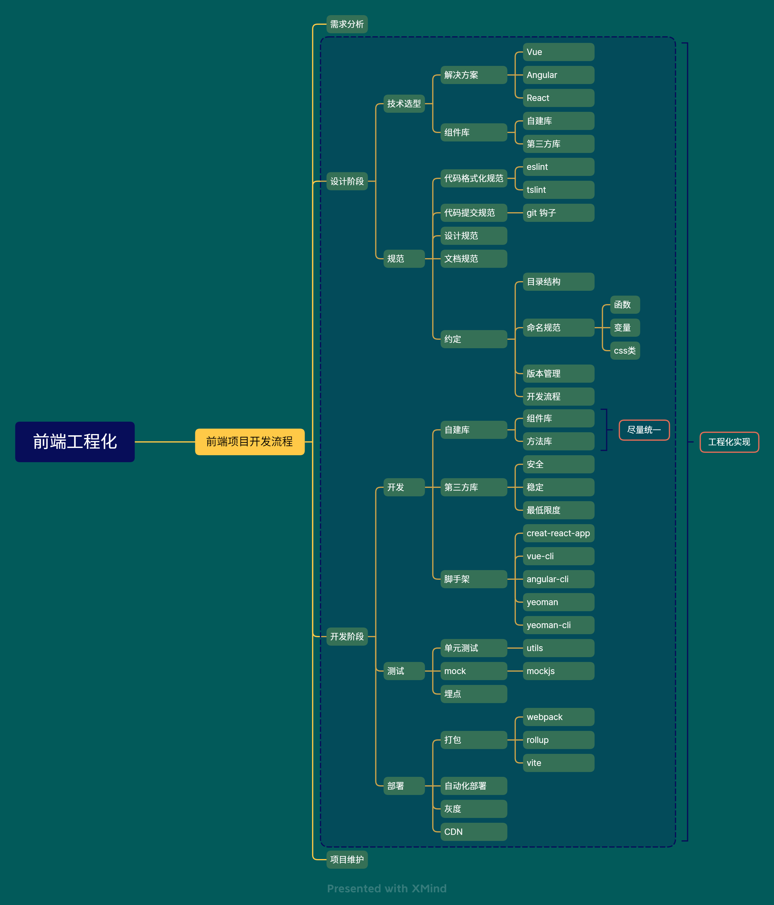
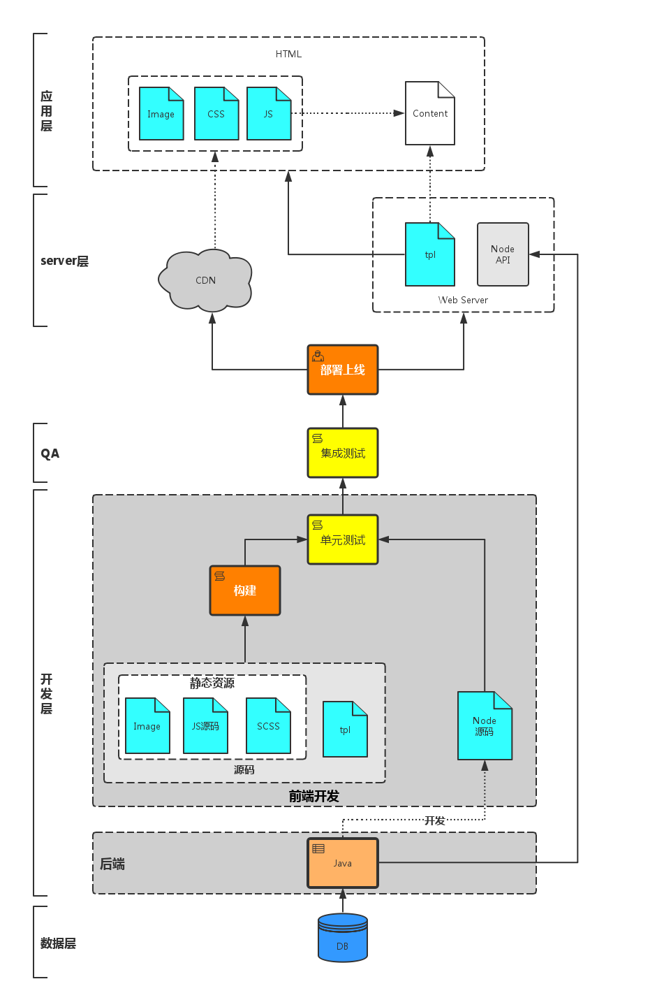
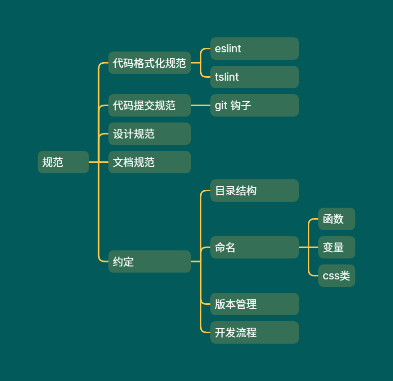
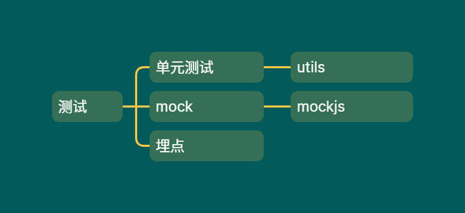
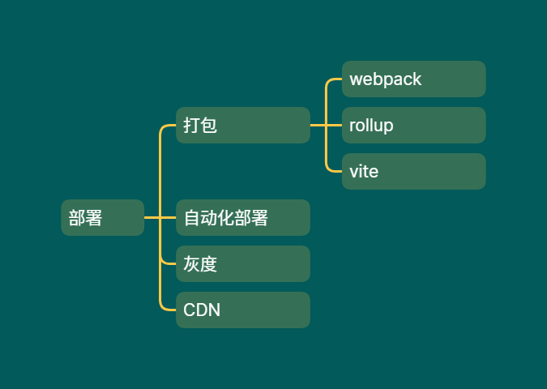

	

## 前言
在项目开发中常常听到前端工程化，那么什么是前端工程化，其要义在于何处，我想是值得了解的问题。

它有哪些目的，解决了哪些问题，又以何种方式实现，这些都是值得探究、值得思考的。
## 一、三问：
- 什么是前端工程化？
- 前端工程化要解决哪些问题？
- 如何实现前端工程化？

### 1.1 什么是前端工程化？
这里先给出我的理解：
- 狭义上的理解：将开发阶段的代码发布到生产环境，包含：构建，分支管理，自动化测试，部署
- 广义上理解：前端工程化应该包含从编码开始到发布，运行和维护阶段

简而言之，在前端规模越来越大，业务逻辑越来越复杂的今天，一切可以`提高效率、降低成本、质量保证`的手段都可以称得上是前端工程化。如果说软件工程是面向问题的（将软件开发流程中的共性抽离出来），把软件工程的思想带入到前端开发中，就是前端工程化。
### 1.2 前端工程化需要解决哪些问题？
我们知道前端工程化的目的在于`提高效率、降低成本、质量保证`，那么哪些问题会对我们的目的形成妨碍呢？
- 开发人员技术不一致所导致的问题：
	- 重复造轮子
	- 代码冗杂，可读性差，难以维护
- 模块化和统一性的矛盾：
- 更新迭代和重构的问题：
### 1.3 如何实现前端工程化？
一个前端项目的开发流程可以概括为：
> 需求分析-->设计阶段-->开发阶段-->（测试阶段-->）部署阶段（-->项目维护）

以下是一个开发过程示意图：

在设计阶段，我们可以：
	1. 使用怎样的`代码管理`方式？
	2. 使用哪种`解决方案`？
- 在开发阶段，我们可以：
	1. 代码审查
	2. 压缩打包
	3. 单元测试
	4. 增量更新
- 在测试阶段，我们可以：
	1. 测试框架
	2. 
- 在部署阶段，我们可以：
	1. 自动化部署
## 二、设计阶段
根据前文，能够知道在设计阶段面临的一些问题，那么怎么解决呢？
我们需要知道前端项目在设计阶段要做的一些事情：技术选型、确立规范、排期、分工。
而技术选型和确立规范就是其中的重中之重。

### 2.1 项目管理
monorepo和multirepo的优缺点
| 场景       | monorepo | multirepo |
| ---------- | -------- | --------- |
| 代码可见性 |          |           |
| 依赖管理   |          |           |
| 代码权限   |          |           |
| 开发迭代   |          |           |
| 工程配置   |          |           |
| 构建部署   |          |           |


> monorepo和multirepo是两种不同的项目管理方式

monorepo和multirepo的优缺点

### 2.2 技术选型


无论是技术框架、编程语言、工具库、UI 库，都属于技术选型的范畴。

一般要遵循的原则有 4 点：
1. 可控性
2. 稳定性
3. 适用性
4. 易用性

一般来说，前端项目选择的框架是 Vue、React、Angular 的一种，根据项目规模和团队技术栈选择其他的工具库、UI 库。

关于技术选型，可以看看这篇文章 [技术选型](https://zhuanlan.zhihu.com/p/346410244)

### 2.3 统一规范



根据项目规模的不同，统一规范的重要性也不可一概而论，但总的来说，统一规范的重要性是随着项目复杂度的提升而提升的。

有哪些地方需要统一规范呢？

- 代码格式化：eslint、tslint
- 代码提交规范：可以使用 git 的钩子函数自定义
- 设计规范：由需求设计人员提供
- 文档规范：注明公共 API、全局变量等
- 一些约定：
  - 目录结构约定：在什么地方做什么事
  - 命名约定：变量、函数、css 类
  - 版本管理
  - 开发流程
### 2.4 相关配置
- package.json
- tsconfig.json
拆分tsconfig.json
```typescript
{
  "files": [], //如果没有file选项，解析器会默认解析所有不在exclude选项中的文件
  "references": [ //可以通过references选项拆分tsconfig.json配置 
    { "path": "./tsconfig.web.json" },
    { "path": "./tsconfig.play.json" },
    { "path": "./tsconfig.node.json" },
    { "path": "./tsconfig.vite-config.json" },
    { "path": "./tsconfig.vitest.json" }
  ]
}
```
- eslintrc.json
- webpack.config.json
- vitest.config.ts


## 三、开发阶段
#### 主旨思想

  
在开发过程中，工程化主要在自建库、选择第三方库、搭建脚手架时发挥作用。

自建库抽离公共函数，避免重复造轮子，应约定尽量使用自建库的方法。

当自建库不能满足需求时，可以选择第三方库来弥补[[MethodologyJSExcutionProcess]]，第三方库应该关注安全性、稳定性、采取最小限度原则（即只使用必要的部分）。

自定义工程脚手架也是非常重要的一部分，可以大大降低重复工作量，脚手架实践了`能够交给机器的事情就交给机器去做`这一思想。

## 四、测试阶段
无论是什么项目，只要它仍在开发迭代，测试就是必要的一环。


常用的测试分类有`单元测试`和`集成测试`，在开发过程中使用的是单元测试，那么什么是单元测试？
> 单元测试（英语：Unit Testing）又称为模块测试，是针对程序模块（软件设计的最小单位）来进行正确性检验的测试工作。

常见的单元测试工具有：Jest、Mocha 等。

一些框架内也集成了单元测试工具，可以根据具体情况选择。

## 五、部署阶段


在项目的部署阶段，我们聚焦于构建和部署。

在构建时需要关注性能优化、自定义配置等，常用构建工具有 webpack、rollup、vite 等，他们各有特点，这里不加赘述。

在部署时需要关注自动化、易用性等，常用的部署工具有 Jenkins。

其他还有灰度和 CDN 等概念，灰度可以理解为青春使用版，即新版本发布时控制流量，易于回退。CDN 技术则是优化网络访问速度。

## 总结

前端工程化的要义在于：把能够交给机器的事情尽量交给机器去做。

其重点在于`统一`，统一的代码规范、统一的命名约定、统一的技术栈、第三方库等等。

而在实际项目开发过程中，前端工程化的实践既依赖设计师、架构师对于项目的先期构建，更强调开发团队间的意见交流。了解工程化概念，明晰其目的，才能避免重复造轮子，代码结构混杂不清等疏漏，提高代码复用性和健壮性。

## 参考资料
- [带你入门前端工程](https://woai3c.gitee.io/introduction-to-front-end-engineering/#%E7%AE%80%E4%BB%8B)
- [浅谈什么是前端工程化	](https://www.cnblogs.com/fsyz/p/8274727.html)
- [大型项目前端架构浅谈](https://juejin.cn/post/6844903853859536903)